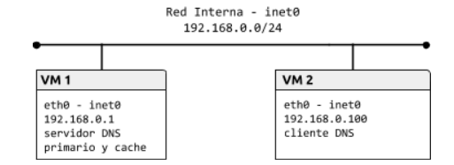
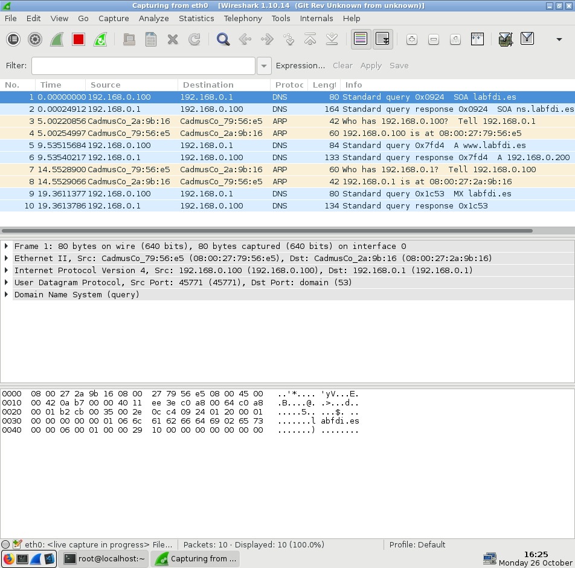

# Práctica 1.3. Domain Name System (DNS)
## Objetivos
En esta práctica, emplearemos herramientas para explorar la estructura del servicio en Internet. Después, configuraremos un servicio de nombres basado en BIND. El objetivo es estudiar tanto los pasos básicos de configuración del servicio, como la base de datos y el funcionamiento del protocolo.

## Cliente DNS
Usaremos clientes DNS, que serán de utilidad tanto para depurar el despliegue del servicio DNS en nuestra red local, como para estudiar la estructura de DNS en Internet. La principal herramienta para consultar servicios DNS es `dig`. En esta primera parte, se usará la máquina física. Si las consultas DNS a determinados servidores estuvieran bloqueadas, se usará un interfaz web como www.digwebinterface.com (activando las opciones “Stats” y “Show command”) o www.diggui.com.

**Ejercicio 1.** Ver el contenido del fichero de configuración del cliente DNS, `/etc/resolv.conf`. Consultar la página de manual de `resolv.conf` y buscar las opciones `nameserver` y `search`.

    resolv.conf: Proporciona acceso al Sistema de Nombres de Dominio (DNS) de internet.
    nameserver: Dirección IP, en notación en punto, de un servidor de nombre.
    search: Lista de búsquedas de nombres de host, por defecto contiene solo el nombre de dominio local.
 
**Ejercicio 2.** Partiendo del servidor raíz a.root-servers.net y usando las respuestas obtenidas, obtener la dirección IP de informatica.ucm.es. Completar la siguiente tabla:

    Usando digwebinterface: 

    - Hostnames or IP addresses: informatica.ucm.es.
    - Type: A
    - Options: show command, colorize output, stats
    - Nameservers: specify myself: a.root-servers.net
    
    Una vez ejecutamos `dig` cogemos la primera respuesta de la Authority section y pinchamos en datos y volvemos a dar a `dig` hasta llegar al final

| **Servidor**       | **Nombre**             | **TTL**  | **Tipo** | Datos |
| ------------       | ----------------- | ------------- | ------ | ------- |
| a.root-servers.net | es.                 | 172800 | NS | a.nic.es. |
| a.nic.es. | es.                 | 86400 | NS | sun.rediris.es. |
| sun.rediris.es. | informatica.ucm.es. | 86400 | CNAME | ucm.es |
| sun.rediris.es. | es.                 | 86400 | NS | 147.96.1.15 |

Nota: Usar el comando `dig @<servidor> <nombre> <tipo>`. Consultar la página de manual de `dig` y la estructura del registro y la base de datos DNS.

**Ejercicio 3.** Obtener el registro SOA de ucm.es. usando un servidor autoritativo de la zona. Identificar los campos relevantes del registro.

Copiar el comando utilizado e indicar los campos relevantes del registro.

    Usando digwebinterface:
    - Hostnames or IP addresses: ucm.es.
    - Type: SOA
    - Options: show command, colorize output, stats
    - Nameservers: sun.rediris.es. (es un servidor autoritativo)

    Salida:
    ;; ANSWER SECTION:
    ucm.es.			86400 IN SOA ucdns.sis.ucm.es. hostmaster.ucm.es. (
            2020102601 ; serial
            28800      ; refresh (8 hours)
            7200       ; retry (2 hours)
            1209600    ; expire (2 weeks)
            86400      ; minimum (1 day)
            )

**Ejercicio 4.** Determinar qué servidor de correo debería usarse para enviar un mail a webmaster@fdi.ucm.es, usar un servidor autoritativo de la zona.

Copiar el comando utilizado e indicar el servidor de correo.

    Usando digwebinterface:
    - Hostnames or IP addresses: webmaster@fdi.ucm.es
    - Type: MX
    - Options: show command, colorize output, stats
    - Nameservers: sun.rediris.es.

    Salida:

    ;; ANSWER SECTION:
    webmaster\@fdi.ucm.es.	86400	IN	MX	1 aspmx.l.google.com.
    webmaster\@fdi.ucm.es.	86400	IN	MX	5 alt1.aspmx.l.google.com.
    webmaster\@fdi.ucm.es.	86400	IN	MX	5 alt2.aspmx.l.google.com.
    webmaster\@fdi.ucm.es.	86400	IN	MX	10 aspmx2.googlemail.com.
    webmaster\@fdi.ucm.es.	86400	IN	MX	10 aspmx3.googlemail.com.
    webmaster\@fdi.ucm.es.	86400	IN	MX	10 ucsmtp.ucm.es.

**Ejercicio 5.** Determinar el nombre de dominio para 147.96.85.71 partiendo del servidor raíz `a.root-servers.net` y usando las respuestas obtenidas. Completar la siguiente tabla:

    Usando digwebinterface:
    - Hostnames or IP addresses: 71.85.96.147.in-addr.arpa.
    - Type: PTR
    - Options: show command, colorize output, stats
    - Nameservers: specify myself: a.root-servers.net.
    
    Para continuar, igual que antes, una vez hagamos `Dig` pulsamos en el servidor autoritativo de la respuesta y volvemos a pulsar `Dig`. Así hasta llegar al resultado final

| **Servidor**       | **Nombre**             | **TTL**  | **Tipo** | Datos |
| ------------       | ----------------- | ------------- | ------ | ------- |
| a.root-servers.net | in-addr.arpa.     | 172800 | NS | a.in-addr-servers.arpa. |
| a.in-addr-servers.arpa. | 147.in-addr.arpa. | 86400 | NS | r.arin.net. |
| r.arin.net. | 96.147.in-addr.arpa. | 86400 | NS | sun.rediris.es. |
| sun.rediris.es. | 71.85.96.147.in-addr.arpa. | 86400 | PTR | www.fdi.ucm.es |

Nota: La opción `-x` de `dig` facilita la búsqueda inversa cuando detecta una dirección IP como argumento, creando el dominio de búsqueda a partir de la dirección IP (esto es, invierte el orden de los bytes y añade `.in-addr.arpa.`) y estableciendo el tipo de registro por defecto a PTR. En el interfaz web, se activa seleccionando “Reverse” como tipo de registro

**Ejercicio 6.** Obtener la IP de www.google.com usando el servidor por defecto. Usar la opción `+trace` del comando `dig` (option “Trace” en el interfaz web) y observar las consultas realizadas.

Copiar el comando utilizado y su salida.

    Digwebinterface:
    - Hostnames or IP addresses: www.google.com
    - Type: unspecified
    - Options: show command, colorize output, stats, trace
    - Nameservers: default

    La IP de www.google.com está en 172.217.4.228

    ; <<>> DiG 9.8.2rc1-RedHat-9.8.2-0.68.rc1.el6_10.7 <<>> +additional +trace www.google.com. @8.8.4.4
    ;; global options: +cmd
    .			86753	IN	NS	m.root-servers.net.
    .			86753	IN	NS	b.root-servers.net.
    .			86753	IN	NS	c.root-servers.net.
    .			86753	IN	NS	d.root-servers.net.
    .			86753	IN	NS	e.root-servers.net.
    .			86753	IN	NS	f.root-servers.net.
    .			86753	IN	NS	g.root-servers.net.
    .			86753	IN	NS	h.root-servers.net.
    .			86753	IN	NS	a.root-servers.net.
    .			86753	IN	NS	i.root-servers.net.
    .			86753	IN	NS	j.root-servers.net.
    .			86753	IN	NS	k.root-servers.net.
    .			86753	IN	NS	l.root-servers.net.
    ;; Received 228 bytes from 8.8.4.4#53(8.8.4.4) in 37 ms

    com.			172800	IN	NS	i.gtld-servers.net.
    com.			172800	IN	NS	m.gtld-servers.net.
    com.			172800	IN	NS	g.gtld-servers.net.
    com.			172800	IN	NS	h.gtld-servers.net.
    com.			172800	IN	NS	c.gtld-servers.net.
    com.			172800	IN	NS	j.gtld-servers.net.
    com.			172800	IN	NS	a.gtld-servers.net.
    com.			172800	IN	NS	k.gtld-servers.net.
    com.			172800	IN	NS	l.gtld-servers.net.
    com.			172800	IN	NS	d.gtld-servers.net.
    com.			172800	IN	NS	f.gtld-servers.net.
    com.			172800	IN	NS	b.gtld-servers.net.
    com.			172800	IN	NS	e.gtld-servers.net.
    ;; Received 492 bytes from 192.112.36.4#53(192.112.36.4) in 54 ms

    google.com.		172800	IN	NS	ns2.google.com.
    google.com.		172800	IN	NS	ns1.google.com.
    google.com.		172800	IN	NS	ns3.google.com.
    google.com.		172800	IN	NS	ns4.google.com.
    ;; Received 280 bytes from 192.48.79.30#53(192.48.79.30) in 30 ms

    www.google.com.		300	IN	A	172.217.4.196
    ;; Received 48 bytes from 216.239.32.10#53(216.239.32.10) in 10 ms

## Servidor DNS
### Preparación del entorno

Para esta parte, configuraremos la topología de red que se muestra en la siguiente figura:

    

Como en prácticas anteriores, construiremos la topología con la herramienta vtopol y un fichero de topología adecuado. Configurar cada interfaz de red como se indica en la figura y comprobar la conectividad entre las máquinas.

### Comandos para preparar el entorno:
### VM1:
        sudo ip link set lo down
        sudo ip addr add 192.168.0.1/24 broadcast 192.168.0.255 dev eth0
        sudo ip link set eth0 up
### VM2:
        sudo ip link set lo down
        sudo ip addr add 192.168.0.100/24 broadcast 192.168.0.255 dev eth0
        sudo ip link set eth0 up
        
### Zona directa (forward)

La máquina VM1 actuará como servidor de nombres del dominio `labfdi.es.` La mayoría de los registros se incluyen en la zona directa.
**Ejercicio 7.** Configurar el servidor de nombres añadiendo una entrada zone para la zona directa en el fichero `/etc/named.conf`. El tipo de servidor de la zona debe ser `master` y el fichero que define la zona, `db.labfdi.es.` Por ejemplo:

        zone "labfdi.es." {
          type master;
          file "db.labfdi.es";
        };
        
Revisar la configuración por defecto y consultar la página de manual de `named.conf` para ver las opciones disponibles para el servidor y las zonas. La recursión debe estar deshabilitada en servidores autoritativos (opción recursion) y no deben restringirse las consultas (opción allow-query). Una vez creado el fichero, ejecutar el comando named-checkconf para comprobar que la sintaxis es correcta.

**En el fichero /etc/named.conf:**

        Comentado la linea de allow-query y cambiado recursion de “yes” a “no”

**Ejercicio 8.** Crear el fichero de la zona directa labfdi.es. en `/var/named/db.labfdi.es` con los registros especificados en la siguiente tabla. Especificar también la directiva $TTL. 

| **Registro**       | **Descripción**   |
| ------------       | ----------------- |
| Start of Authority (SOA) | Elegir libremente los valores de refresh, update, expiry y nx ttl. El servidor primario es ns.labfdi.es y el e-mail de contacto es contact@labfdi.es.  |
| Servidor de nombres (NS) | El servidor de nombres es ns.labfdi.es, como se especifica en el registro SOA |
| Dirección (A) del servidor de nombres | La dirección de ns.labfdi.es es 192.168.0.1 (VM1) |
| Direcciones (A y AAAA) del servidor web | Las direcciones de www.labfdi.es son 192.168.0.200 y fd00::1 |
| Servidor de correo (MX) | El servidor de correo es mail.labfdi.es |
| Dirección (A) del servidor de correo | La dirección de mail.labfdi.es es 192.168.0.250 |
| Nombre canónico (CNAME) de servidor | correo.labfdi.es es un alias de mail.labfdi.es |

Una vez generado el fichero de zona, se debe comprobar su integridad con el comando `named-checkzone <nombre_zona> <fichero>`. Finalmente, arrancar el servicio DNS con el comando `service named start`.
    
**Nota:** No olvidar que los nombres FQDN terminan en el dominio raíz (“.”). El nombre de la zona puede especificarse con @ en el nombre del registro.

Copiar el fichero de la zona directa.

        Contenido fichero /var/named/db.labfdi.es:

        $TTL    2d
        labfdi.es. 	IN	SOA     ns.labfdi.es. contact@labfdi.es. (
                                2003004         ; Serial
                                3h              ; Refresh
                                14M             ; Update retry
                                3W12h           ; Expire
                                2h20M           ; nx TTL
                                )
                        IN	NS	ns.labfdi.es.
        ns.labfdi.es.   IN	A	192.168.0.1
        www.labfdi.es.  IN	A	192.168.0.200
        www.labfdi.es.  IN	AAAA    fd00::1
         labfdi.es           IN	MX	10	mail.labfdi.es.
        mail.labfdi.es. IN	A	192.168.0.250
        correo.labfdi.es.       IN      CNAME   mail.labfdi.es.

        Comprobar integridad:

        sudo named-checkzone labfdi.es /var/named/db.labfdi.es

        Después:

        Service named start

**Ejercicio 9.** Configurar la máquina virtual cliente para que use el nuevo servidor de nombres. Para ello, crear o modificar `/etc/resolv.conf` con los nuevos valores para `nameserver` y `search`.

Copiar el fichero de configuración del cliente.

        Fichero:

        ; generated by /usr/sbin/dhclient-script
        search ns.labfdi.es
        nameserver 192.168.0.1

**Ejercicio 10.** Usar el comando dig en el cliente para obtener la información del dominio `labfdi.es`.

Copiar el comando utilizado y su salida.

        Comando: dig soa labfdi.es
        
        Salida:
        ; <<>> DiG 9.9.4-RedHat-9.9.4-61.el7_5.1 <<>> soa labfdi.es
        ;; global options: +cmd
        ;; Got answer:
        ;; ->>HEADER<<- opcode: QUERY, status: NOERROR, id: 14782
        ;; flags: qr aa rd; QUERY: 1, ANSWER: 1, AUTHORITY: 1, ADDITIONAL: 2
        ;; WARNING: recursion requested but not available

        ;; OPT PSEUDOSECTION:
        ; EDNS: version: 0, flags:; udp: 4096
        ;; QUESTION SECTION:
        ;labfdi.es.			IN	SOA

        ;; ANSWER SECTION:
        labfdi.es.		172800	IN	SOA	ns.labfdi.es. contact\@labfdi.es. 2003004 10800 840 1857600 8400

        ;; AUTHORITY SECTION:
        labfdi.es.		172800	IN	NS	ns.labfdi.es.

        ;; ADDITIONAL SECTION:
        ns.labfdi.es.		172800	IN	A	192.168.0.1

        ;; Query time: 1 msec
        ;; SERVER: 192.168.0.1#53(192.168.0.1)
        ;; WHEN: Mon Oct 26 16:23:38 CET 2020
        ;; MSG SIZE  rcvd: 122

**Ejercicio 11.** Realizar más consultas y, con la ayuda de wireshark:
- Comprobar el protocolo y puerto usado por el cliente y servidor DNS
- Estudiar el formato (campos incluidos y longitud) de los mensajes correspondientes a las preguntas y respuestas DNS.

Copiar una captura de Wireshark con los mensajes DNS.

        Inicio captura en VM1 (por ejemplo) y realizo consulta con comandos:

        dig soa labfdi.es.
        dig www.labfdi.es
        dig mx labfdi.es (este no me ha funcionado)

    

## Zona inversa (reverse)

Además, el servidor incluirá una base de datos para la búsqueda inversa. La zona inversa contiene los registros PTR correspondientes a las direcciones IP.

**Ejercicio 12.** Añadir otra entrada zone para la zona inversa `0.168.192.in-addr.arpa.` en `/etc/named.conf`. El tipo de servidor de la zona debe ser master y el fichero que define la zona, `db.0.168.192`.

        Solución:

        zone "0.168.192.in-addr.arpa." {
                type master;
                file "db.0.168.192";
        };

**Ejercicio 13.** Crear el fichero de la zona inversa en `/var/named/db.0.168.192` con los registros SOA, NS y PTR. Esta zona usará el mismo servidor de nombres y parámetros de configuración en el registro SOA. Después, reiniciar el servicio DNS con el comando `service named restart` (o bien, recargar la configuración con el comando `service named reload`).

Copiar el fichero de la zona inversa.

Solución:

        $TTL    604800
        0.168.192.in-addr.arpa. IN	SOA     ns.labfdi.es    contact.labfdi.es. (
                                        2	; Serial
                                        604800  ; Refresh
                                        86400   ; Retry
                                        2419200 ; Expire
                                        604800  ; nx TTL
                                        )
        @                       IN	NS	ns.labfdi.es.
        @                       IN	PTR     ns.labfdi.es.
        1                        IN	                PTR     ns.labfdi.es.
        200                     IN	PTR     labfdi.es.
        250                     IN	PTR     mail.labfdi.es.

**Ejercicio 14.** Comprobar el funcionamiento de la resolución inversa, obteniendo el nombre asociado a la dirección 192.168.0.250.

Copiar el comando utilizado y su salida.

        En VM2: dig  250.0.168.192.in-addr.arpa.

        ; <<>> DiG 9.9.4-RedHat-9.9.4-61.el7_5.1 <<>> 250.0.168.192.in-addr.arpa.
        ;; global options: +cmd
        ;; Got answer:
        ;; ->>HEADER<<- opcode: QUERY, status: NOERROR, id: 3681
        ;; flags: qr aa rd; QUERY: 1, ANSWER: 0, AUTHORITY: 1, ADDITIONAL: 1
        ;; WARNING: recursion requested but not available

        ;; OPT PSEUDOSECTION:
        ; EDNS: version: 0, flags:; udp: 4096
        ;; QUESTION SECTION:
        ;250.0.168.192.in-addr.arpa.	IN	A

        ;; AUTHORITY SECTION:
        0.168.192.in-addr.arpa.	604800	IN	SOA	ns.labfdi.es.0.168.192.in-addr.arpa. contact.labfdi.es. 2 604800 86400 2419200 604800

        ;; Query time: 0 msec
        ;; SERVER: 192.168.0.1#53(192.168.0.1)
        ;; WHEN: Mon Oct 26 17:29:26 CET 2020
        ;; MSG SIZE  rcvd: 121

