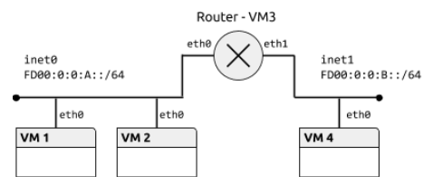

# Práctica 1.4. Protocolo IPv6

## Objetivos

En esta práctica se estudian los aspectos básicos del protocolo IPv6, el manejo de los diferentes tipos de direcciones y mecanismos de configuración. Además se analizarán las características más importantes del protocolo ICMP versión 6. 

## Preparación del entorno para la práctica

Configuraremos la topología de red que se muestra en la siguiente figura:

    

El fichero de configuración de la topología tendría el siguiente contenido:

    netprefix inet
    machine 1 0 0
    machine 2 0 0 
    machine 3 0 0 1 1
    machine 4 0 1

## Direcciones de enlace local

Una dirección de enlace local es únicamente válida en la subred que está definida. Ningún encaminador dará salida a un datagrama con una dirección de enlace local como destino. El prefijo de formato para estas direcciones es `fe80::/10`.

**Ejercicio 1 [VM1, VM2].** Activar el interfaz eth0 en VM1 y VM2. Comprobar las direcciones de enlace local que tienen asignadas con el comando `ip`.

    sudo ip link set eth0 up
    
    VM1: fe80::a00:27ff:fe2a:9b16/64
    VM2: fe80::a00:27ff:fe79:56e5/64

**Ejercicio 2 [VM1, VM2].** Comprobar la conectividad entre VM1 y VM2 con la orden `ping6`. Cuando se usan direcciones de enlace local, y sólo en ese caso, es necesario especificar el interfaz origen, añadiendo `%<nombre_interfaz>` a la dirección. Consultar las opciones del comando `ping6` en la página de manual. Observar el tráfico generado con Wireshark, especialmente los protocolos encapsulados en cada datagrama y los parámetros del protocolo IPv6.

Copiar el comando utilizados y su salida. Copiar una captura de pantalla de Wireshark donde se vean los campos de la cabecera IPv6.

    ping6 fe80::a00:27ff:fe79:56e5 -I eth0
    
    SALIDA:
      PING fe80::a00:27ff:fe79:56e5(fe80::a00:27ff:fe79:56e5) from fe80::a00:27ff:fe2a:9b16%eth0 eth0: 56 data bytes
      64 bytes from fe80::a00:27ff:fe79:56e5%eth0: icmp_seq=1 ttl=64 time=1.66 ms
      64 bytes from fe80::a00:27ff:fe79:56e5%eth0: icmp_seq=2 ttl=64 time=0.638 ms
      64 bytes from fe80::a00:27ff:fe79:56e5%eth0: icmp_seq=3 ttl=64 time=0.956 ms
      64 bytes from fe80::a00:27ff:fe79:56e5%eth0: icmp_seq=4 ttl=64 time=1.28 ms
      64 bytes from fe80::a00:27ff:fe79:56e5%eth0: icmp_seq=5 ttl=64 time=0.927 ms
      ^C
      --- fe80::a00:27ff:fe79:56e5 ping statistics ---
      5 packets transmitted, 5 received, 0% packet loss, time 4005ms
      rtt min/avg/max/mdev = 0.638/1.094/1.669/0.354 ms
      

   

**Ejercicio 3 [Router, VM4].** Activar el interfaz de VM4 y los dos interfaces de Router. Comprobar la conectividad entre Router y VM1, y entre Router y VM4 usando la dirección de enlace local.

Copiar los comandos utilizados y su salida.

    Router: sudo ip link set eth0 up
            sudo ip link set eht1 up
    VM4: sudo ip link set eth0 up

    VM1: ping6 fe80::a00:27ff:fe1a:ae3d -I eth0

    PING fe80::a00:27ff:fe1a:ae3d(fe80::a00:27ff:fe1a:ae3d) from fe80::a00:27ff:fe2a:9b16%eth0 eth0: 56 data bytes
    64 bytes from fe80::a00:27ff:fe1a:ae3d%eth0: icmp_seq=1 ttl=64 time=1.31 ms
    64 bytes from fe80::a00:27ff:fe1a:ae3d%eth0: icmp_seq=2 ttl=64 time=1.21 ms
    64 bytes from fe80::a00:27ff:fe1a:ae3d%eth0: icmp_seq=3 ttl=64 time=1.20 ms
    64 bytes from fe80::a00:27ff:fe1a:ae3d%eth0: icmp_seq=4 ttl=64 time=1.15 ms
    ^C
    --- fe80::a00:27ff:fe1a:ae3d ping statistics ---
    4 packets transmitted, 4 received, 0% packet loss, time 3004ms
    rtt min/avg/max/mdev = 1.150/1.220/1.316/0.073 ms

    VM4: ping6 fe80::a00:27ff:fed4:4a6a -I eth0

    PING fe80::a00:27ff:fed4:4a6a(fe80::a00:27ff:fed4:4a6a) from fe80::a00:27ff:fe9c:5223%eth0 eth0: 56 data bytes
    64 bytes from fe80::a00:27ff:fed4:4a6a%eth0: icmp_seq=1 ttl=64 time=1.27 ms
    64 bytes from fe80::a00:27ff:fed4:4a6a%eth0: icmp_seq=2 ttl=64 time=1.23 ms
    64 bytes from fe80::a00:27ff:fed4:4a6a%eth0: icmp_seq=3 ttl=64 time=0.531 ms
    ^C
    --- fe80::a00:27ff:fed4:4a6a ping statistics ---
    3 packets transmitted, 3 received, 0% packet loss, time 2003ms
    rtt min/avg/max/mdev = 0.531/1.015/1.279/0.342 ms

Para saber más… En el protocolo IPv4 también se reserva el bloque 169.254.0.0/16 para direcciones de enlace local, cuando no es posible la configuración de los interfaces por otras vías. Los detalles se describen en el RFC 3927.

## Direcciones ULA

Una dirección ULA (Unique Local Address) puede usarse dentro de una organización, de forma que los encaminadores internos del sitio deben encaminar los datagramas con una dirección ULA como destino. El prefijo de formato para estas direcciones es `fc00::/7`.

**Ejercicio 4 [VM1, VM2].** Configurar VM1 y VM2 para que tengan una dirección ULA en la red `fd00:0:0:a::/64` con el comando `ip`. La parte de identificador de interfaz puede elegirse libremente, siempre que no coincida para ambas máquinas. Incluir la longitud del prefijo al fijar las direcciones.

Copiar los comandos utilizados.

**VM1:**

    sudo ip a add fd00:0:0:a::1/64 dev eth0
    sudo ip link set eth0 up
    
**VM2:** 

    sudo ip a add fd00:0:0:a::2/64 dev eth0
    sudo ip link set eth0 up

**Ejercicio 5 [VM1, VM2].** Comprobar la conectividad entre VM1 y VM2 con la orden `ping6` usando la nueva dirección. Observar los mensajes intercambiados con Wireshark.

    ping6 fd00:0:0:a::2 -I eth0

   

 

**Ejercicio 6 [Router, VM4].** Configurar direcciones ULA en los dos interfaces de Router (redes `fd00:0:0:a::/64` y `fd00:0:0:b::/64`) y en el de VM4 (red `fd00:0:0:b::/64`). Elegir el identificador de interfaz de forma que no coincida dentro de la misma red.

Copiar los comandos utilizados.

**Router:** 

    sudo ip a add fd00:0:0:a::3/64 dev eth0
    sudo ip a add fd00:0:0:b::1/64 dev eth1
    sudo ip link set eth0 up
    sudo ip link set eth1 up

**VM4:**
    
    sudo ip a add fd00:0:0:b::2/64 dev eth0
    sudo ip link set eth0 up

**Ejercicio 7 [Router].** Comprobar la conectividad entre Router y VM1, y entre Router y VM4 usando direcciones ULA. Comprobar además que VM1 no puede alcanzar a VM4.

Copiar los comandos utilizados.

**Router:**

    ping6 fd00:0:0:a::1 -I eth0
    
    PING fd00:0:0:a::1(fd00:0:0:a::1) from fd00:0:0:a::3 eth0: 56 data bytes
    64 bytes from fd00:0:0:a::1: icmp_seq=1 ttl=64 time=0.868 ms
    64 bytes from fd00:0:0:a::1: icmp_seq=2 ttl=64 time=1.21 ms
    64 bytes from fd00:0:0:a::1: icmp_seq=3 ttl=64 time=1.29 ms
    64 bytes from fd00:0:0:a::1: icmp_seq=4 ttl=64 time=1.19 ms
    ^C
    --- fd00:0:0:a::1 ping statistics ---
    4 packets transmitted, 4 received, 0% packet loss, time 3005ms
    rtt min/avg/max/mdev = 0.868/1.141/1.295/0.166 ms

    
    ping6 fd00:0:0:b::2 -I eth1
    
    PING fd00:0:0:b::2(fd00:0:0:b::2) from fd00:0:0:b::1 eth1: 56 data bytes
    64 bytes from fd00:0:0:b::2: icmp_seq=1 ttl=64 time=1.14 ms
    64 bytes from fd00:0:0:b::2: icmp_seq=2 ttl=64 time=1.31 ms
    64 bytes from fd00:0:0:b::2: icmp_seq=3 ttl=64 time=1.09 ms
    64 bytes from fd00:0:0:b::2: icmp_seq=4 ttl=64 time=1.21 ms
    ^C
    --- fd00:0:0:b::2 ping statistics ---
    4 packets transmitted, 4 received, 0% packet loss, time 3006ms
    rtt min/avg/max/mdev = 1.098/1.193/1.315/0.085 ms
    
**VM1:**

    ping6 fd00:0:0:b::2  -I eth0
    
    [cursoredes@localhost ~]$ ping6 fd00:0:0:b::2 -I eth0
    connect: Network is unreachable
 

## Encaminamiento estático

Según la topología que hemos configurado en esta práctica, Router debe encaminar el tráfico entre las redes `fd00:0:0:a::/64` y `fd00:0:0:b::/64`. En esta sección vamos a configurar un encaminamiento estático basado en las rutas que fijaremos manualmente en todas las máquinas.

**Ejercicio 8 [VM1, Router].** Consultar las tablas de rutas en VM1 y Router con el comando `ip route`. Consultar la página de manual del comando para seleccionar las rutas IPv6.

    route -6 ---------------------------- (en ambas máquinas)

**Ejercicio 9 [Router].** Para que Router actúe efectivamente como encaminador, hay que activar el reenvío de paquetes (packet forwarding). De forma temporal, se puede activar con el comando `sysctl -w net.ipv6.conf.all.forwarding=1`.

    sudo sysctl -w net.ipv6.conf.all.forwarding=1

**Ejercicio 10 [VM1, VM2, VM4].** Finalmente, hay que configurar la tabla de rutas en las máquinas virtuales. Añadir la dirección correspondiente de Router como ruta por defecto con el comando  `ip route`. Comprobar la conectividad entre VM1 y VM4 usando el comando `ping6`.

Copiar los comandos utilizados y su salida.

**VM1 y VM2:**

    sudo ip route add fd00:0:0:b::/64 via fd00:0:0a::3
    
**VM4:**

    sudo ip route add fd00:0:0:a::/64 via fd00:0:0:b::1

**PING:**
    
    ping6 fd00:0:0:b::2 -I eth0

    PING fd00:0:0:b::2(fd00:0:0:b::2) from fd00:0:0:a::1 eth0: 56 data bytes
    64 bytes from fd00:0:0:b::2: icmp_seq=1 ttl=63 time=4.58 ms
    64 bytes from fd00:0:0:b::2: icmp_seq=2 ttl=63 time=2.34 ms
    64 bytes from fd00:0:0:b::2: icmp_seq=3 ttl=63 time=0.965 ms
    64 bytes from fd00:0:0:b::2: icmp_seq=4 ttl=63 time=0.812 ms
    ^C
    --- fd00:0:0:b::2 ping statistics ---
    4 packets transmitted, 4 received, 0% packet loss, time 3005ms
    rtt min/avg/max/mdev = 0.812/2.175/4.580/1.512 ms

**Ejercicio 11 [VM1, Router, VM4].** Abrir Wireshark en Router e iniciar dos capturas, una en cada interfaz de red. Borrar la tabla de vecinos en VM1 y Router (con `ip neigh flush dev <interfaz>`). Usar la orden `ping6` entre VM1 y VM4. Completar la siguiente tabla con todos los mensajes hasta el primer ICMP Echo Reply:

**Red fd00:0:0:a::/64 - Router (eth0)**

|   **MAC Origen**  | **MAC Destino** | **IPv6 Origen**  | **IPv6 Destino** | **ICMPv6 Tipo** |
| ----------------- | --------------- | ---------------- | ---------------- | --------------- |
| 08:00:27:2a:9b:16 | 33:33:ff:00:00:03  | fd00:0:0:a::1 | ff02::1:ff00:3 | Neighbor solicitation |
| 08:00:27:1a:ae:3d | 08:00:27:2a:9b:16 | fd00:0:0:a::3 | fd00:0:0:a::1 | Neighbor Advertisement |
| 08:00:27:2a:9b:16 | 33:33:ff:00:00:03 | fe80::a00:27ff:fe2a:9b16 | ff02::1:ff00:3 | Neighbor solicitation |
| 08:00:27:1a:ae:3d | 08:00:27:2a:9b:16 | ff02::1:ff00:3 | fe80::a00:27ff:fe2a:9b16 |Neighbor Advertisement |
| 08:00:27:2a:9b:16 | 33:33:ff:00:00:03 | fe80::a00:27ff:fe2a:9b16 | ff02::1:ff00:3 | Neighbor solicitation |
| 08:00:27:1a:ae:3d | 08:00:27:2a:9b:16 | ff02::1:ff00:3 | fe80::a00:27ff:fe2a:9b16 | Neighbor Advertisement |
| 08:00:27:2a:9b:16 | 08:00:27:1a:ae:3d| fd00:0:0:a::1 | fd00:0:0:b::2 | Echo request |
| 08:00:27:1a:ae:3d | 08:00:27:2a:9b:16 | fd00:0:0:b::2 | fd00:0:0:a::1 |Echo reply |

**Red fd00:0:0:b::/64 - Router (eth1)**

| **MAC Origen** | **MAC Destino** | **IPv6 Origen**  | **IPv6 Destino** | **ICMPv6 Tipo** |
| ------------      | ----------------- | ------------- | ------ | ------- |
| 08:00:27:d4:4a:6a | 33:33:ff:00:00:02 | fe80::a00:27ff:fed4:4a6a | ff02::1:ff00:2 | Neighbor solicitation |
| 08:00:27:2c:52:23 | 08:00:27:d4:4a:6a | fd00:0:0:b::2 | fe80:a00:27ff:fed4:4a6a | Neighbor Advertisement |
| 08:00:27:d4:4a:6a | 08:00:27:2c:52:23 | fd00:0:0:a::1 | fd00:0:0:b::2 | Echo request |
| 08:00:27:2c:52:23 |  08:00:27:d4:4a:6a | fd00:0:0:b::2 | fd00:0:0:a::1 | Echo reply |

Copiar dos capturas de pantalla de Wireshark.

   

   

## Configuración persistente

Las configuraciones realizadas en los apartados anteriores son volátiles y desaparecen cuando se reinician las máquinas. Durante el arranque del sistema se pueden configurar automáticamente los interfaces según la información almacenada en el disco.

**Ejercicio 12 [Router].** Crear los ficheros `ifcfg-eth0` e `ifcfg-eth1` en el directorio `/etc/sysconfig/network-scripts/` con la configuración de cada interfaz. Usar las siguientes opciones (descritas en `/usr/share/doc/initscripts-*/sysconfig.txt`):

    TYPE=Ethernet
    BOOTPROTO=none
    IPV6ADDR=<dirección IP estática en formato CIDR>
    IPV6_DEFAULTGW=<dirección IP estática del encaminador por defecto (si existe)>
    DEVICE=<nombre del interfaz>

Copiar el contenido de los ficheros.

    TYPE=Ethernet
    BOOTPROTO=none
    IPV6ADDR=fd00:0:0:a::f/64
    IPV6_DEFAULTGW=fd00:0:0:a::3
    DEVICE=eth0

    TYPE=Ethernet
    BOOTPROTO=none
    IPV6ADDR=fd00:0:0:b::f/64
    IPV6_DEFAULTGW=fd00:0:0:b::1
    DEVICE=eth1

**Ejercicio 13 [Router].** Comprobar la configuración persistente con las órdenes `ifup` e `ifdown`.

Copiar los comandos utilizados y su salida.

    [cursoredes@localhost ~]$ sudo ifup eth0
    INFO      : [ipv6_wait_tentative] Waiting for interface eth0 IPv6 address(es) to leave the 'tentative' state
    INFO      : [ipv6_wait_tentative] Waiting for interface eth0 IPv6 address(es) to leave the 'tentative' state
    [cursoredes@localhost ~]$ sudo ifup eth1
    INFO      : [ipv6_wait_tentative] Waiting for interface eth1 IPv6 address(es) to leave the 'tentative' state
    INFO      : [ipv6_wait_tentative] Waiting for interface eth1 IPv6 address(es) to leave the 'tentative' state
    [cursoredes@localhost ~]$ sudo ifdown eth0
    [cursoredes@localhost ~]$ sudo ifdown eth1

## Autoconfiguración. Anuncio de prefijos

El protocolo de descubrimiento de vecinos se usa también para la autoconfiguración de los interfaces de red. Cuando se activa un interfaz, se envía un mensaje de descubrimiento de encaminadores. Los encaminadores presentes responden con un anuncio que contiene, entre otros, el prefijo de la red. 

**Ejercicio 14 [VM1, VM2, VM4].** Eliminar las direcciones ULA de los interfaces desactivándolos con `ip link`.

    sudo ip link set eth0 down

**Ejercicio 15 [Router].** Configurar el servicio `zebra` para que el encaminador anuncie prefijos. Para ello, crear el archivo `/etc/quagga/zebra.conf` e incluir la información de los prefijos para las dos redes. Cada entrada será de la forma:

    interface eth0
      no ipv6 nd suppress-ra
      ipv6 nd prefix fd00:0:0:a::/64
      
**Solucion:**

    interface eth0
            no ipv6 nd suppress-ra
            ipv6 nd	prefix fd00:0:0:a::/64
    interface eth1
            no ipv6	nd suppress-ra
            ipv6 nd	prefix fd00:0:0:b::/64
  
Finalmente, arrancar el servicio con el comando `service zebra start`.

**Ejercicio 16 [VM4].** Comprobar la autoconfiguración del interfaz de red en VM4, volviendo a activar el interfaz y consultando la dirección asignada.

Copiar la dirección asignada.

        Comando: sudo ip link set eth0 up

        Ip aadr list:

        2: eth0: <BROADCAST,MULTICAST,UP,LOWER_UP> mtu 1500 qdisc pfifo_fast state UP group default qlen 1000
            link/ether 08:00:27:9c:52:23 brd ff:ff:ff:ff:ff:ff
            inet6 fd00::b:a00:27ff:fe9c:5223/64 scope global mngtmpaddr dynamic 
               valid_lft 2591999sec preferred_lft 604799sec
            inet6 fe80::a00:27ff:fe9c:5223/64 scope link 
               valid_lft forever preferred_lft forever

**Ejercicio 17 [VM1, VM2].** Estudiar los mensajes del protocolo de descubrimiento de vecinos:
- Activar el interfaz en VM2, comprobar que está configurado correctamente e iniciar una captura de paquetes con Wireshark.
- Activar el interfaz en VM1 y estudiar los mensajes ICMP de tipo Router Solicitation y Router Advertisement.
- Comprobar las direcciones destino y origen de los datagramas, así como las direcciones destino y origen de la trama Ethernet. Especialmente la relación entre las direcciones IP y MAC. Estudiar la salida del comando `ip maddr`.

Copiar una captura de pantalla de Wireshark.

        [cursoredes@localhost ~]$ ip maddr

        1:	lo
            inet  224.0.0.1
            inet6 ff02::1
            inet6 ff01::1
        2:	eth0
            link  33:33:00:00:00:01
            link  01:00:5e:00:00:01
            link  33:33:ff:2a:9b:16
            inet  224.0.0.1
            inet6 ff02::1:ff2a:9b16 users 2
            inet6 ff02::1
            inet6 ff01::1

        [cursoredes@localhost ~]$ ip maddr
        1:	lo
            inet  224.0.0.1
            inet6 ff02::1
            inet6 ff01::1
        2:	eth0
            link  33:33:00:00:00:01
            link  01:00:5e:00:00:01
            link  33:33:ff:79:56:e5
            inet  224.0.0.1
            inet6 ff02::1:ff79:56e5 users 2
            inet6 ff02::1
            inet6 ff01::1
            
 

   

           

Para saber más… En el proceso de autoconfiguración se genera también el identificador de interfaz según el Extended Unique Identifier (EUI-64) que se describe en el RFC 4193. La configuración del protocolo de anuncio de encaminadores tiene múltiples opciones que se pueden consultar en la documentación de zebra (ej. intervalo entre anuncios no solicitados). Cuando sólo se necesita un servicio que implemente el anuncio de prefijos, y no algoritmos de encaminamiento para el router, se puede usar el proyecto de código libre Router Advertisement Daemon, radvd.

**Ejercicio 18 [VM1].** La generación del identificador de interfaz mediante EUI-64 supone un problema de privacidad para las máquinas clientes, que pueden ser rastreadas por su dirección MAC. En estos casos, es conveniente activar las extensiones de privacidad para generar un identificador de interfaz pseudoaleatorio temporal para las direcciones globales. Activar las extensiones de privacidad en VM1 con `sysctl -w net.ipv6.conf.eth0.use_tempaddr=2`.

Copiar la dirección asignada.

        inet6 fd00::a:bd84:46b5:5e6b:ce87/64 scope global temporary dynamic

## ICMPv6

El protocolo ICMPv6 permite el intercambio de mensajes para el control de la red, tanto para la detección de errores como para la consulta de la configuración de ésta. Durante el desarrollo de la práctica hemos visto los más importantes.

**Ejercicio 19.** Generar mensajes de los siguientes tipos en la red y estudiarlos con ayuda de Wireshark:

- Solicitud y respuesta de eco.
- Solicitud y anuncio de encaminador.
- Solicitud y anuncio de vecino.
- Destino inalcanzable - Sin ruta al destino (Code: 0).
- Destino inalcanzable - Dirección destino inalcanzable (Code: 3)

Copiar capturas de pantalla de Wireshark con los dos últimos mensajes.

