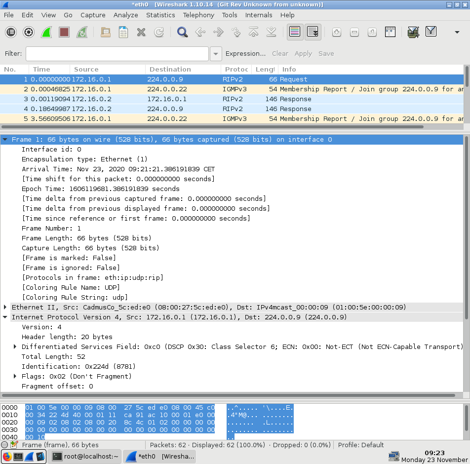
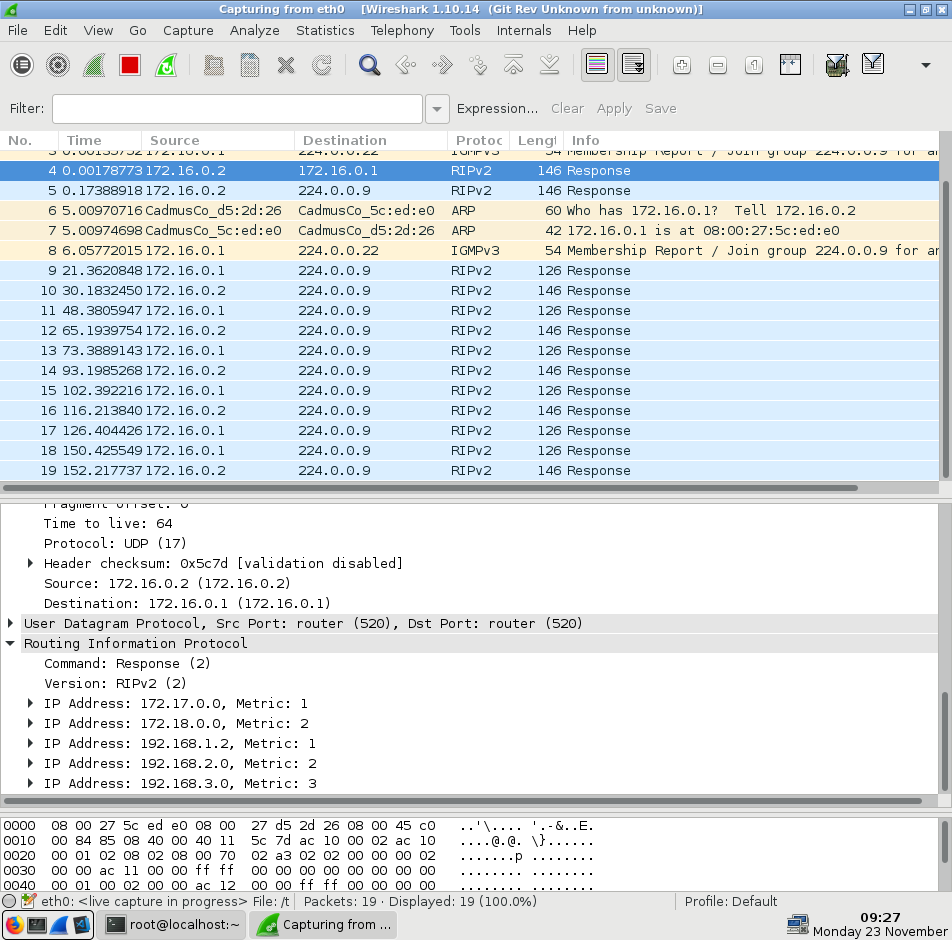
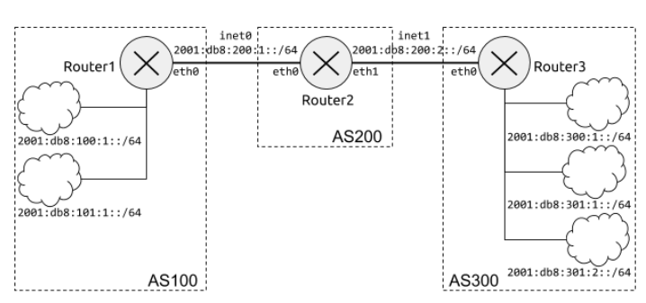
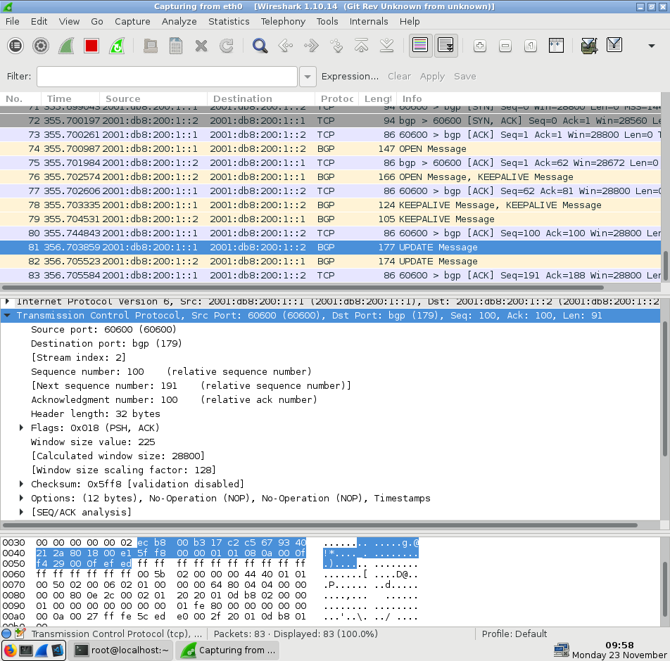

# Práctica 1.5. RIP y BGP

**Objetivos**

En esta práctica se afianzan los conceptos elementales del encaminamiento. En particular, se estudia un protocolo de encaminamiento interior y otro exterior: RIP (Routing Information Protocol) y BGP (Border Gateway Protocol).

Existen muchas implementaciones de los protocolos de encaminamiento. En esta práctica vamos a utilizar Quagga, que actualmente implementa RIP (versiones 1 y 2), RIPng, OSPF, OSPFv3, IS-IS y BGP. Quagga está estructurado en diferentes servicios (uno para cada protocolo) controlados por un servicio central (Zebra) que hace de interfaz entre la tabla de encaminamiento del kernel y la información de encaminamiento de cada protocolo.

Todos los ficheros de configuración han de almacenarse en el directorio `/etc/quagga`. La sintaxis de estos ficheros es sencilla y está disponible en http://quagga.net. Revisar especialmente la correspondiente a RIP y BGP en https://www.quagga.net/docs/quagga.html. Además, en `/usr/share/doc/quagga-0.99.22.4` hay ficheros de ejemplo.

**Contenidos**

## Parte I. Protocolo interior: RIP

**Preparación del entorno**

Configuraremos la topología de red que se muestra en la siguiente figura:

    

Cada encaminador (Router1…Router4) tiene tres interfaces, cada uno conectado a una red diferente.

Al igual que en prácticas anteriores, usaremos la herramienta vtopol para construir automáticamente esta topología. A continuación se muestra el contenido del fichero de configuración de la topología:

    netprefix inet
    machine 1 0 0 1 3 2 4
    machine 2 0 0 1 1 2 5
    machine 3 0 2 1 1 2 6
    machine 4 0 2 1 3 2 7

Para facilitar la configuración de las máquinas, la siguiente tabla muestra las direcciones de cada uno de los interfaces de los encaminadores:

|   **Máquina virtual**  | **Interfaz** | **Dirección de red**  | **Dirección IP** |
| ----------------- | --------------- | ---------------- | ---------------- |
| Router 1 | eth0 - eth1 - eth2 | 172.16.0.0/16 - 172.19.0.0/16 - 192.168.0.0/24 | 172.16.0.1 - 172.19.0.1 - 192.168.0.1 |
| Router 2 | eth0 - eth1 - eth2 | 172.16.0.0/16 - 172.17.0.0/16 - 192.168.1.0/24 | 172.16.0.2 - 172.17.0.2 - 192.168.1.2 |
| Router 3 | eth0 - eth1 - eth2 | 172.18.0.0/16 - 172.17.0.0/16 - 192.168.2.0/24 | 172.18.0.1 - 172.17.0.1 - 192.168.2.4 |
| Router 4 | eth0 - eth1 - eth2 | 172.18.0.0/16 - 172.19.0.0/16 - 192.168.3.0/24 | 172.16.0.1 - 172.19.0.1 - 192.168.3.4 |

**Nota**: Asegurarse de que configuramos los adaptadores en VirtualBox correctamente, comenzando con el Adaptador 1 en vez del 2.

**Ejercicio 1.** Configurar todos los encaminadores según la figura y tabla anterior. Además, activar el reenvío de paquetes IPv4 igual que en la práctica 1.1. Después, comprobar:
- Que los encaminadores adyacentes son alcanzables, por ejemplo, Router1 puede hacer `ping` a Router2 y Router4.
- Que la tabla de encaminamiento de cada encaminador es la correcta e incluye una entrada para cada una de las tres redes a las que está conectado.

**Router 1**

        $ip link set eth0 up
        $ip link set eth1 up
        $ip link set eth2 up
        $ip addr add 172.16.0.1/16 dev eth0
        $ip addr add 172.19.0.1/16 dev eth1
        $ip addr add 192.168.0.1/24 dev eth2
        $sysctl -w net.ipv4.conf.all.forwarding=1    
        
**Router 2**

        $ip link set eth0 up
        $ip link set eth1 up
        $ip link set eth2 up
        $ip addr add 172.16.0.2/16 dev eth0
        $ip addr add 172.17.0.2/16 dev eth1
        $ip addr add 192.168.1.2/24 dev eth2
        $sysctl -w net.ipv4.conf.all.forwarding=1
        
 **Router 3**
 
        $ip link set eth0 up
        $ip link set eth1 up
        $ip link set eth2 up
        $ip addr add 172.18.0.3/16 dev eth0
        $ip addr add 172.17.0.3/16 dev eth1
        $ip addr add 192.168.2.3/24 dev eth2
        $sysctl -w net.ipv4.conf.all.forwarding=1
        
 **Router 4**
 
        $ip link set eth0 up
        $ip link set eth1 up
        $ip link set eth2 up
        $ip addr add 172.18.0.4/16 dev eth0
        $ip addr add 172.19.0.4/16 dev eth1
        $ip addr add 192.168.3.0/24 dev eth2
        $sysctl -w net.ipv4.conf.all.forwarding=1
        
 Comprobar con ping de Router 1 a Router 2:
 
        ping 172.16.0.2 

**Configuración del protocolo RIP**

**Ejercicio 2.** Configurar RIP en todos los encaminadores para que intercambien información:
- Crear un fichero `ripd.conf` en `/etc/quagga` con el contenido que se muestra a continuación.
- Iniciar el servicio RIP (y Zebra) con service `ripd start`.

Contenido del fichero `/etc/quagga/ripd.conf`:

    # Activar el encaminamiento por RIP
    router rip
     # Definir la versión del protocolo que se usará
     version 2
     # Habilitar información de encaminamiento en redes asociadas a los interfaces
     network eth0
     network eth1
     network eth2
     
**Ejercicio 3.** Consultar la tabla de encaminamiento de RIP y de Zebra en cada encaminador con el comando `vtysh` (`sudo vtysh -c "show ip rip"` y `sudo vtysh -c "show ip route"`). Comprobar también la tabla de encaminamiento de IPv4 con el comando `ip` (`ip route`).
Copia los comandos usados y su salida.

        [root@localhost ~]# vtysh -c "show ip rip"
        Codes: R - RIP, C - connected, S - Static, O - OSPF, B - BGP
        Sub-codes:
              (n) - normal, (s) - static, (d) - default, (r) - redistribute,
              (i) - interface

             Network            Next Hop         Metric From            Tag Time
        C(i) 172.16.0.0/16      0.0.0.0               1 self              0
        R(n) 172.17.0.0/16      172.16.0.2            2 172.16.0.2        0 02:30
        R(n) 172.18.0.0/16      172.19.0.4            2 172.19.0.4        0 02:51
        C(i) 172.19.0.0/16      0.0.0.0               1 self              0
        C(i) 192.168.0.0/24     0.0.0.0               1 self              0
        R(n) 192.168.1.2/32     172.16.0.2            2 172.16.0.2        0 02:30
        R(n) 192.168.2.0/24     172.16.0.2            3 172.16.0.2        0 02:30
        R(n) 192.168.3.0/24     172.19.0.4            2 172.19.0.4        0 02:51

        [root@localhost ~]# vtysh -c "show ip route"
        Codes: K - kernel route, C - connected, S - static, R - RIP,
               O - OSPF, I - IS-IS, B - BGP, A - Babel,
               > - selected route, * - FIB route

        C>* 127.0.0.0/8 is directly connected, lo
        C>* 172.16.0.0/16 is directly connected, eth0
        R>* 172.17.0.0/16 [120/2] via 172.16.0.2, eth0, 00:01:04
        R>* 172.18.0.0/16 [120/2] via 172.19.0.4, eth1, 00:00:51
        C>* 172.19.0.0/16 is directly connected, eth1
        C>* 192.168.0.0/24 is directly connected, eth2
        R>* 192.168.1.2/32 [120/2] via 172.16.0.2, eth0, 00:01:04
        R>* 192.168.2.0/24 [120/3] via 172.16.0.2, eth0, 00:00:57
        R>* 192.168.3.0/24 [120/2] via 172.19.0.4, eth1, 00:00:51

        [root@localhost ~]# ip route
        172.16.0.0/16 dev eth0 proto kernel scope link src 172.16.0.1 
        172.17.0.0/16 via 172.16.0.2 dev eth0 proto zebra metric 2 
        172.18.0.0/16 via 172.19.0.4 dev eth1 proto zebra metric 2 
        172.19.0.0/16 dev eth1 proto kernel scope link src 172.19.0.1 
        192.168.0.0/24 dev eth2 proto kernel scope link src 192.168.0.1 
        192.168.1.2 via 172.16.0.2 dev eth0 proto zebra metric 2 
        192.168.2.0/24 via 172.16.0.2 dev eth0 proto zebra metric 3 
        192.168.3.0/24 via 172.19.0.4 dev eth1 proto zebra metric 2

**Ejercicio 4.** Con la herramienta wireshark, estudiar los mensajes RIP intercambiados, en particular:
- Encapsulado.
- Direcciones origen y destino.
- Campo de versión.
- Información para cada ruta: dirección de red, máscara de red, siguiente salto y distancia.

Copy una captura de pantalla de Wireshark con mensajes RIP mostrando el formato de uno de ellos.

    

**Ejercicio 5.** Eliminar el enlace entre Router1 y Router4 (por ejemplo, desactivando el interfaz eth1 en Router4). Comprobar que Router1 deja de recibir los anuncios de Router4 y que, pasados aproximadamente 3 minutos (valor de timeout por defecto para las rutas), ha reajustado su tabla.

Copia los comandos usados y su salida.

**Comando**

        ip link set eth1 down
        
**Wireshark**

    

  

**vtysh -c "show rip ip"**

        [root@localhost ~]# vtysh -c "show ip rip"
        Codes: R - RIP, C - connected, S - Static, O - OSPF, B - BGP
        Sub-codes:
              (n) - normal, (s) - static, (d) - default, (r) - redistribute,
              (i) - interface

             Network            Next Hop         Metric From            Tag Time
        C(i) 172.16.0.0/16      0.0.0.0               1 self              0
        R(n) 172.17.0.0/16      172.16.0.2            2 172.16.0.2        0 03:00
        R(n) 172.18.0.0/16      172.16.0.2            3 172.16.0.2        0 03:00
        C(i) 172.19.0.0/16      0.0.0.0               1 self              0
        C(i) 192.168.0.0/24     0.0.0.0               1 self              0
        R(n) 192.168.1.2/32     172.16.0.2            2 172.16.0.2        0 03:00
        R(n) 192.168.2.0/24     172.16.0.2            3 172.16.0.2        0 03:00
        R(n) 192.168.3.0/24     172.16.0.2            4 172.16.0.2        0 03:00

**Ejercicio 6 (Opcional).** Los servicios de Quagga pueden configurarse de forma interactiva mediante un terminal (`telnet`), de forma similar a los encaminadores comerciales. Configurar ripd vía VTY: 
- Añadir “password asor” al fichero `ripd.conf`, desactivar el protocolo (`no router rip`) y comentar el resto de entradas. Una vez cambiado el fichero, reiniciar el servicio.
- Conectar al VTY de ripd y configurarlo. En cada comando se puede usar ? para mostrar la ayuda asociada.
    
      $ telnet localhost ripd
      Trying 127.0.0.1...
      Connected to localhost.
      Escape character is '^]'.

      Hello, this is Quagga (version 0.99.20.1)
      Copyright © 1996-2005 Kunihiro Ishiguro, et al.  
      User Access Verification

      Password: asor
      localhost.localdomain> enable
      localhost.localdomain# configure terminal
      localhost.localdomain(config)# router rip
      localhost.localdomain(config-router)# version 2
      localhost.localdomain(config-router)# network eth0
      localhost.localdomain(config-router)# write
      Configuration saved to /etc/quagga/ripd.conf
      localhost.localdomain(config-router)# exit
      localhost.localdomain(config)# exit
      localhost.localdomain# show running-config
      Current configuration:
      !
      password asor
      !
      router rip
       version 2
       network eth0
      !
      line vty
      !
      end
      localhost.localdomain# write
      Configuration saved to /etc/quagga/ripd.conf
      localhost.localdomain# exit

Nota: Para poder escribir la configuración en `ripd.conf`, el usuario quagga debe tener los permisos adecuados sobre el fichero. Para cambiar el propietario del fichero, ejecutar el comando `chown quagga:quagga /etc/quagga/ripd.conf`.

## Parte II. Protocolo exterior: BGP

**Preparación del entorno**

Configuraremos la topología de red con 3 AS, siendo uno de ellos el proveedor de los otros dos:

    

Nota: El prefijo 2001:db8::/32 está reservado para documentación y ejemplos (RFC 3849).
Crearemos esta topología (sin las redes internas de los AS) con la herramienta vtopol y el siguiente fichero:

        netprefix inet
        machine 1 0 0 
        machine 2 0 0 1 1
        machine 3 0 1

Para facilitar la configuración de las máquinas, la siguiente tabla muestra las direcciones de cada uno de los interfaces de los encaminadores:

|   **Máquina virtual**  | **Interfaz** | **Dirección de red**  | **Dirección IP** |
| ----------------- | --------------- | ---------------- | ---------------- |
| Router 1 | eth0 | 2001:db8:200:1::/64 | 2001:db8:200:1::1 |
| Router 2 | eth0 - eth1 | 2001:db8:200:1::/64 - 2001:db8:200:2::/64 | 2001:db8:200:1::1 - 2001:db8:200:2::2 |
| Router 3 | eth0 | 2001:db8:200:1::/64 | 2001:db8:200:2::3 |

**Ejercicio 7.** Configurar los encaminadores según se muestra en la figura anterior. Debe comprobarse la conectividad entre máquinas adyacentes.

**Router 1**

        $ip link set eth0 up
        $ip addr add 2001:db8:200:1::1/64 dev eth0

**Router 2**

        $ip link set eth0 up
        $ip link set eth1 up
        $ip addr add 2001:db8:200:1::2/64 dev eth0
        $ip addr add 2001:db8:200:2::2/64 dev eth1

**Router 3**

        $ip link set eth0 up
        $ip addr add 2001:db8:200:2::3/64 dev eth0

### Configuración del protocolo BGP

**Ejercicio 8.** Consultar la documentación de las clases de teoría para determinar el tipo de AS (`stub`, `multihomed` o `transit` ) y los prefijos de red que debe anunciar. Suponed que el RIR ha asignado a cada AS prefijos de longitud 48 y que los prefijos anunciados deben agregarse al máximo.

|   **Número de AS**  | **Tipo** | **Prefijos Agregados**  |
| ----------------- | --------------- | ---------------- |
| AS100 | Stub | 2001:db8:100::/47 |
| AS200 | Tránsito |  |
| AS300 | Stub | 2001:db8:300::/47 |

**Ejercicio 9.** Configurar BGP en los encaminadores para que intercambien información:
Crear un fichero `bgpd.conf` en `/etc/quagga` usando como referencia el que se muestra a continuación.
Iniciar el servicio BGP (y Zebra) con `service bgpd start`.
Por ejemplo, el contenido del fichero `/etc/quagga/bgpd.conf` de Router1 en el AS 100 sería:

        # Activar el encaminamiento BGP en el AS 100
        router bgp 100
         # Establecer el identificador de encaminador BGP
         bgp router-id 0.0.0.1
         # Añadir el encaminador BGP vecino en el AS 200
         neighbor 2001:db8:200:1::2 remote-as 200
         # Empezar a trabajar con direcciones IPv6
         address-family ipv6
          # Anunciar un prefijo de red agregado
          network 2001:db8:100::/47
          # Activar IPv6 en el encaminador BGP vecino
          neighbor 2001:db8:200:1::2 activate
         # Dejar de trabajar con direcciones IPv6
         exit-address-family
         
 **Router 2**
 
        #Activar el encaminamiento BGP en el AS 200
        router bgp 200
        #Establecer el identificador de encaminador BGP
        bgp router-id 0.0.0.2
        #Añadir el encaminador BGP vecino en el AS 200
        neighbor 2001:db8:200:1::1 remote-as 100
        neighbor 2001:db8:200:2::3 remote-as 300
        #Empezar a trabajar con direcciones IPv6
        address-family ipv6
        #Activar IPv6 en el encaminador BGP vecino
        neighbor 2001:db8:200:1::1 activate
        neighbor 2001:db8:200:2::3 activate
        #Dejar de trabajar con direcciones IPv6
        exit-address-family

 
 **Router 3**
 
        #Activar el encaminamiento BGP en el AS 300
        router bgp 300
        #Establecer el identificador de encaminador BGP
        bgp router-id 0.0.0.3
        #Añadir el encaminador BGP vecino en el AS 200
        neighbor 2001:db8:200:2::2 remote-as 200
        #Empezar a trabajar con direcciones IPv6
        address-family ipv6
        #Anunciar un prefijo de red agregado
        network 2001:db8:300::/47
        #Activar IPv6 en el encaminador BGP vecino
        neighbor 2001:db8:200:2::2 activate
        #Dejar de trabajar con direcciones IPv6
        exit-address-family

 
**Ejercicio 10.** Consultar la tabla de encaminamiento de BGP y de Zebra en cada encaminador con el comando `vtysh` (`sudo vtysh -c "show ipv6 bgp"` y `sudo vtysh -c "show ipv6 route"`). Comprobar también la tabla de encaminamiento de IPv6 con el comando `ip` (`ip -6 route`).

Copia los comandos usados y su salida.

        [root@localhost ~]# vtysh -c "show ipv6 bgp"
        BGP table version is 0, local router ID is 0.0.0.1
        Status codes: s suppressed, d damped, h history, * valid, > best, i - internal,
                      r RIB-failure, S Stale, R Removed
        Origin codes: i - IGP, e - EGP, ? - incomplete

           Network          Next Hop            Metric LocPrf Weight Path
        *> 2001:db8:100::/47
                            ::                       0         32768 i
        *> 2001:db8:300::/47
                            2001:db8:200:1::2
                                                                   0 200 300 i

        Total number of prefixes 2

        [root@localhost ~]# vtysh -c "show ipv6 route"
        Codes: K - kernel route, C - connected, S - static, R - RIPng,
               O - OSPFv6, I - IS-IS, B - BGP, A - Babel,
               > - selected route, * - FIB route

        C>* ::1/128 is directly connected, lo
        C>* 2001:db8:200:1::/64 is directly connected, eth0
        B>* 2001:db8:300::/47 [20/0] via fe80::a00:27ff:fed5:2d26, eth0, 00:00:10
        C>* fe80::/64 is directly connected, eth0

        [root@localhost ~]# ip -6 route
        unreachable ::/96 dev lo metric 1024 error -113 pref medium
        unreachable ::ffff:0.0.0.0/96 dev lo metric 1024 error -113 pref medium
        2001:db8:200:1::/64 dev eth0 proto kernel metric 256 pref medium
        2001:db8:300::/47 via fe80::a00:27ff:fed5:2d26 dev eth0 proto zebra metric 1024 pref medium
        unreachable 2002:a00::/24 dev lo metric 1024 error -113 pref medium
        unreachable 2002:7f00::/24 dev lo metric 1024 error -113 pref medium
        unreachable 2002:a9fe::/32 dev lo metric 1024 error -113 pref medium
        unreachable 2002:ac10::/28 dev lo metric 1024 error -113 pref medium
        unreachable 2002:c0a8::/32 dev lo metric 1024 error -113 pref medium
        unreachable 2002:e000::/19 dev lo metric 1024 error -113 pref medium
        unreachable 3ffe:ffff::/32 dev lo metric 1024 error -113 pref medium
        fe80::/64 dev eth0 proto kernel metric 256 pref medium

**Ejercicio 11.** Con ayuda de la herramienta wireshark, estudiar los mensajes BGP intercambiados (`OPEN`, `KEEPALIVE` y `UPDATE`).

Copia una captura de pantalla de Wireshark con mensajes BGP mostrando el formato del mensaje UPDATE.

**Si no aparecen los mensajes OPEN y UPDATE, reiniciar el servicio con Wireshark abierto**

    

